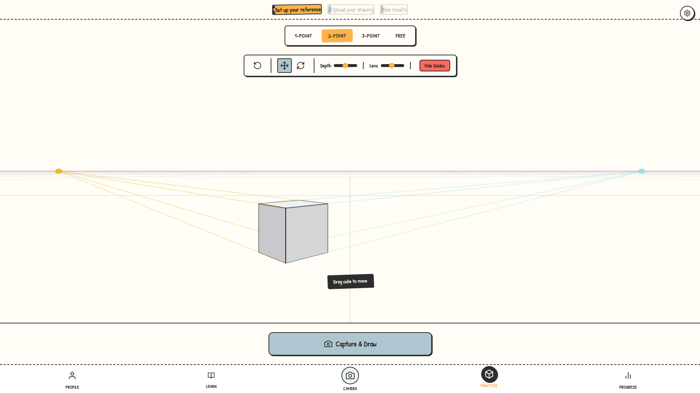

# Art Fundamentals Tutor 🎨

**Master perspective drawing with interactive 3D tools and AI-powered feedback.**

Art Fundamentals Tutor is a web application designed to help artists understand and practice the core concepts of perspective. It combines a real-time 3D reference workspace with Gemini AI analysis to bridge the gap between theory and practice.

 *<!-- Add a screenshot here later if available -->*

## ✨ Key Features

### 🧊 Interactive 3D Workspace
*   **Real-time Reference**: Manipulate a 3D cube in real-time to see how perspective changes with rotation and camera angle.
*   **Perspective Modes**: Switch instantly between **1-Point**, **2-Point**, and **3-Point** perspective presets.
*   **Free Look**: Break the rules and explore freely with a fully unlocked camera.
*   **Visual Guides**: Toggle horizon lines, vanishing points, and perspective grids to visualize the underlying geometry.

### 🤖 AI Critique Zone
*   **Gemini Vision Integration**: Upload or take a photo of your drawing, and let Google's Gemini AI analyze your accuracy.
*   **Smart Feedback**: Get instant grading (A-F), specific constructive criticism, and actionable tips on how to improve.
*   **Wireframe Overlay**: Compare your drawing directly against the "ground truth" 3D wireframe to spot errors instantly.

### 📈 Gamified Progress
*   **Level Up**: Earn XP for every practice session, critique, and lesson completed.
*   **Daily Goals**: Tackle dynamic daily challenges to keep your skills sharp.
*   **Streaks**: Build a habit with daily practice streaks.
*   **Art Gallery**: Your critique history is saved automatically. Review your past work and track your improvement over time.

### 👤 Personalization
*   **Profile**: customize your display name and avatar.
*   **Difficulty Settings**: Adjust the strictness of the AI grading (Beginner, Intermediate, Advanced) to match your skill level.

## 🛠️ Tech Stack

*   **Frontend**: React 18 with TypeScript
*   **Build Tool**: Vite
*   **3D Rendering**: Three.js / @react-three/fiber / @react-three/drei
*   **Styling**: Tailwind CSS
*   **AI**: Google Gemini Pro Vision API
*   **Icons**: Lucide React

## 🚀 Getting Started

### Prerequisites

*   Node.js (v18 or higher)
*   npm or yarn
*   A Google Gemini API Key

### Installation

1.  **Clone the repository**
    ```bash
    git clone https://github.com/TaseenC718/Art_Fundamentals_Tutor.git
    cd Art_Fundamentals_Tutor
    ```

2.  **Install dependencies**
    ```bash
    npm install
    ```

3.  **Configure Environment**
    Create a `.env` file in the root directory and add your Gemini API key:
    ```env
    VITE_GEMINI_API_KEY=your_api_key_here
    ```

4.  **Run the Development Server**
    ```bash
    npm run dev
    ```

5.  **Open in Browser**
    Navigate to `http://localhost:5173` to start practicing!

## 🤝 Contributing

Contributions are welcome! Please feel free to submit a Pull Request.

1.  Fork the project
2.  Create your feature branch (`git checkout -b feature/AmazingFeature`)
3.  Commit your changes (`git commit -m 'Add some AmazingFeature'`)
4.  Push to the branch (`git push origin feature/AmazingFeature`)
5.  Open a Pull Request

## 📄 License

Distributed under the MIT License. See `LICENSE` for more information.

---

*Built with ❤️ for artists everywhere.*
